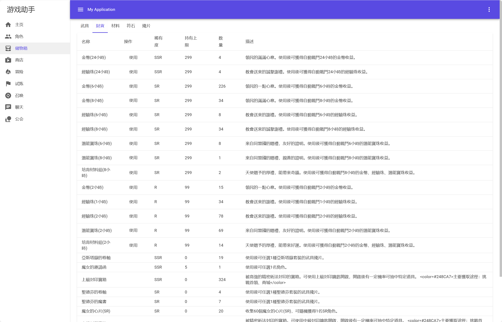
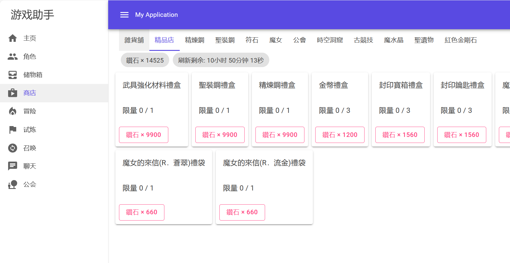

# MementoMori 游戏助手

施工中






## Todos

<!-- prettier-ignore -->
<table>
  <tbody>
  <tr >
      <td>

- [ ] 多账号支持
- [ ] 主页
    - [x] 用户登陆
    - [x] 领取每日登陆奖励
    - [x] 领取每日 VIP 礼物
    - [x] 一键发送/接收友情点
    - [x] 一键领取礼物箱
    - [x] 一键领取任务奖励
    - [x] 一键领取徽章奖励
    - [x]  一键使用固定物品
- [ ] 交换商店
    - [x] 普通物品购买
    - [x] 符石购买
- [ ] 角色
	- [x] 角色列表
	- [x] 角色属性
	- [x] 角色装备详细
	- [ ] 升级
	- [ ] 突破
    - [ ] 编组

</td>
<td>

- [ ] 储物箱
	- [x] 自动使用物品
	- [x] 自动精炼SABC装备为魔装、继承到D级别装备
	- [x] 神装自动继承到D装
	- [x] 装备自动打磨
	- [ ] 手动使用物品
- [ ] 冒险
    - [x] 领取自动战斗奖励
    - [x] 一键高速战斗
    - [x] 首领一键扫荡
    - [x] 自动刷关
- [ ] 试炼
    - [x] 无穷之塔一键扫荡
    - [x] 无穷之塔自动刷关
    - [ ] 幻影神殿一键挑战
    - [x] 古竞技场一键挑战5次
    - [x] 祈愿之泉一键全部领取
    - [x] 祈愿之泉一键远征
    - [x] 时空洞窟一键自动执行
- [ ] 抽卡
    - [x] 每日免费/金币抽卡
    - [x] 卡池列表
    - [x] 手动抽卡
- [ ] 公会
    - [x] 公会签到
    - [x] 公会讨伐战自动扫荡

</td>
</tr>

  </tbody>
</table>


## 使用

进入到发布页面：https://github.com/moonheart/mementomori-helper/releases, 然后下载 `publish-win-x64.zip` 解压。

要运行的话,你需要配置好你的账号信息. 然后就可以运行 `MementoMori.WebUI.exe` 了, 找到类似 `Now listening on: http://0.0.0.0:5290` 的日志, 打开这个地址就可以了.

进入网页之后, 先点击一次登录, 之后就可以随意操作了.


## 自动任务

程序会在特定时间执行特定操作

### 每 24 小时执行 (11:30)
- 收取每日登录奖励
- 收取每日 VIP 奖励
- 收取自动战斗奖励
- 收取发送友情点
- 收取礼物箱
- 强化一次装备 (自动选择当前有角色装备的等级最低的装备, 用于完成每日任务) ([请看自动任务配置](#自动任务))
- 主线扫荡 3 次
- 无穷之塔扫荡 3 次
- 竞技场 5 次 (自动选择列表战力最低作为对手) ([请看自动任务配置](#自动任务))
- 免费高速战斗 (免费一次, 月卡一次)
- 公会签到
- 公会讨伐战
- 祈愿之泉收取奖励
- 祈愿之前自动派遣
- 时空洞窟自动执行 ([请看自动任务配置](#自动任务))
- 收取每日/每周任务奖励
- 使用固定道具 ([请看自动任务配置](#自动任务))
- 消耗道具抽卡 (配置请看 [下面的抽卡配置](#抽卡)) ([请看自动任务配置](#自动任务))
- 自动进阶角色 (R->R+, SR->SR+) ([请看自动任务配置](#自动任务))

### 每四小时执行 (3:30,7:30,11:30,15:30,19:30,23:30)
    
- 收取自动战斗奖励
- 祈愿之泉派遣+收取
- 公会讨伐
- 友情点收取			
- 任务奖励收取
- 自动抽卡 (配置请看 [下面的抽卡配置](#抽卡)) ([请看自动任务配置](#自动任务))
- 使用固定物品 ([请看自动任务配置](#自动任务))


## 配置

配置文件是 `appsettings.user.json`, 你可以把 `appsettings.json` 中的配置复制到 `appsettings.user.json` 然后修改, 就可以覆盖默认配置了.

下面是 `appsettings.user.json` 的示例

``` json
{
  "AuthOption": {
    "ClientKey": "", // 在这里填写自己的clientkey
    "DeviceToken": "",
    "AppVersion": "1.4.4",
    "OSVersion": "Android OS 13 / API-33 (TKQ1.220829.002/V14.0.12.0.TLACNXM)",
    "ModelName": "Xiaomi 2203121C",
    "UserId": 0 // 把这里的0改成自己的用户id
  }
}
```

### 帐号配置

#### 方法1
在 Android 手机上登录一次帐号, 然后获取配置文件 `/data/data/jp.boi.mementomori.android/shared_prefs/jp.boi.mementomori.android.v2.playerprefs.xml`,
重命名为 `account.xml` 放到项目目录.

#### 方法2
在 Windows 上用 DMM 登录一次游戏, 然后找到注册表 `\HKEY_CURRENT_USER\Software\BankOfInnovation\MementoMori`, 拿到 UserId 和 Clientkey
- UserId: xxxxxx_Userid_hxxxxxx
- ClientKey: xxxxxx_ClientKey_hxxxxxx

双击名称, 会显示二进制数据, 把右侧的文本抄下来, ClientKey 共 32 个字母, 注意不要抄错, 不包含引号.

> # 警告! ClientKey 相当于密码, 不要泄露给别人, 不要发到群里.

然后填写到 `appsettings.user.json` 文件中, AuthOption.ClientKey 和 AuthOption.UserId.

### 时空洞窟

配置路径 `GameConfig.DungeonBattleRelicSort`

时空洞窟自动执行的时候, 会需要选择各种加成效果, 这个配置用来设置优先选择哪些加成效果, 靠前的会优先选择.

Id 是加成效果的编号, 具体哪个加成效果对应哪个 Id 可以在 [这里看](https://www.moonheartmoon.com/mementomori-masterbook/?lang=ZhTw&mb=DungeonBattleRelicMB) 

### 抽卡

配置路径 `GameConfig.GachaConfig`

在执行自动抽卡的时候, 会消耗道具, 这个配置可以指定能够消耗哪些道具来抽卡.

具体的道具类型和Id可以在 [这里看](https://www.moonheartmoon.com/mementomori-masterbook/?lang=ZhTw&mb=ItemMB) 

``` json
{
      "AutoGachaConsumeUserItems": [
        { "ItemType": "Gold", "ItemId": 1}, // 金幣
        {
          "ItemType": "GachaTicket",
          "ItemId": 1 // 聖天使的神諭召喚券
        },
        {
          "ItemType": "GachaTicket",
          "ItemId": 2 //白金召喚券
        },
        {
          "ItemType": "GachaTicket",
          "ItemId": 4 // 命運召喚券
        },
        {
          "ItemType": "GachaTicket",
          "ItemId": 5 // 黑葬武具召喚券
        },
        {
          "ItemType": "GachaTicket",
          "ItemId": 6 // 天光武具召喚券
        },
        {
          "ItemType": "GachaTicket",
          "ItemId": 7 // 禁忌武具召喚券
        },
        { "ItemType": "FriendPoint", "ItemId": 1 } // 好友點數
      ]
    }
```

### 自动任务

配置路径 `GameConfig.AutoJob`

示例如下

``` json
{
  "AuthOption": {
    "ClientKey": "", // 在这里填写自己的clientkey
    "DeviceToken": "",
    "AppVersion": "1.4.4",
    "OSVersion": "Android OS 13 / API-33 (TKQ1.220829.002/V14.0.12.0.TLACNXM)",
    "ModelName": "Xiaomi 2203121C",
    "UserId": 0 // 把这里的0改成自己的用户id
  },
  "AutoJob": {
    "AutoReinforcementEquipmentOneTime": true, // 强化一次装备
    "AutoPvp": true, // 自动竞技场
    "AutoDungeonBattle": true, // 自动时空洞窟
    "AutoUseItems": true, // 自动使用固定道具
    "AutoFreeGacha": true, // 自动免费抽卡
    "AutoRankUpCharacter": true // 自动合成角色
  }
}
```

### 多开修改端口号

在 `appsettings.user.json` 里面修改, 比如下面是把端口修改为 5700

``` json
{
  "AuthOption": {
    "ClientKey": "", // 在这里填写自己的clientkey
    "DeviceToken": "",
    "AppVersion": "1.4.4",
    "OSVersion": "Android OS 13 / API-33 (TKQ1.220829.002/V14.0.12.0.TLACNXM)",
    "ModelName": "Xiaomi 2203121C",
    "UserId": 0 // 把这里的0改成自己的用户id
  },
  "Kestrel": {
    "Endpoints": {
      "Http": {
        "Url": "http://localhost:5700"
      }
    }
  }
}
```
